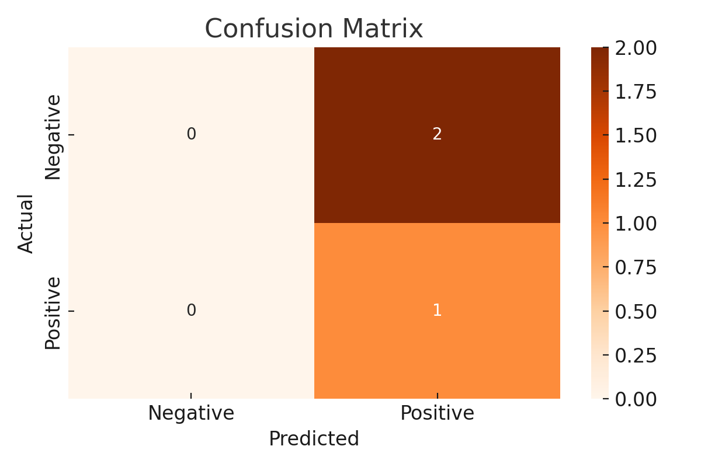
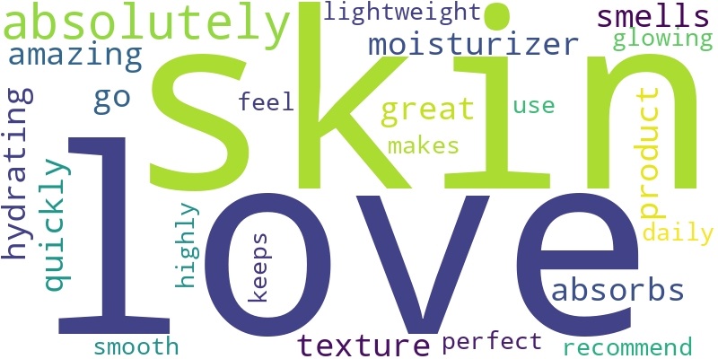
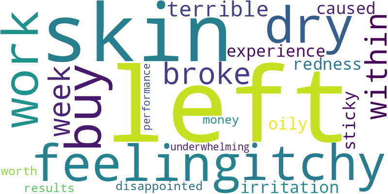

# 💄 Beauty Product Review Sentiment Analysis

This project uses natural language processing (NLP) to classify beauty/skincare product reviews as **positive** or **negative**. It uses TF-IDF vectorization and a Naive Bayes classifier to analyze customer sentiment.

---

## 📂 Dataset
- 10 sample reviews (simulated real-world structure)
- Format: review_text, label (1 = positive, 0 = negative)

---

## ⚙️ Methods
- Text preprocessing (lowercasing, stopword removal)
- TF-IDF vectorization
- Naive Bayes classification
- Evaluation: accuracy, confusion matrix, F1-score
- Word clouds for positive vs. negative terms

---

## 📈 Results

### Confusion Matrix  

### Word Clouds  
**Positive Reviews**  

**Negative Reviews**  

---

## 💡 Business Insight
- Positive reviews emphasize words like “smooth”, “love”, “hydrating”.
- Negative reviews often contain “dry”, “itchy”, “disappointed”.
- Can be used by product teams to detect areas for product improvement or marketing focus.

---

## 👤 Author
**Suvathi Mariyappan Lakshmi**  
[LinkedIn](https://linkedin.com/in/suvathi-m) • [Tableau Portfolio](https://public.tableau.com/app/profile/suvathi.mariyappan.lakshmi/vizzes)
